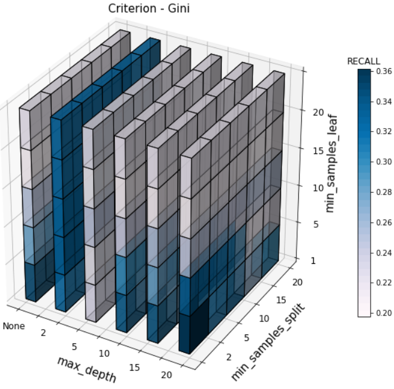
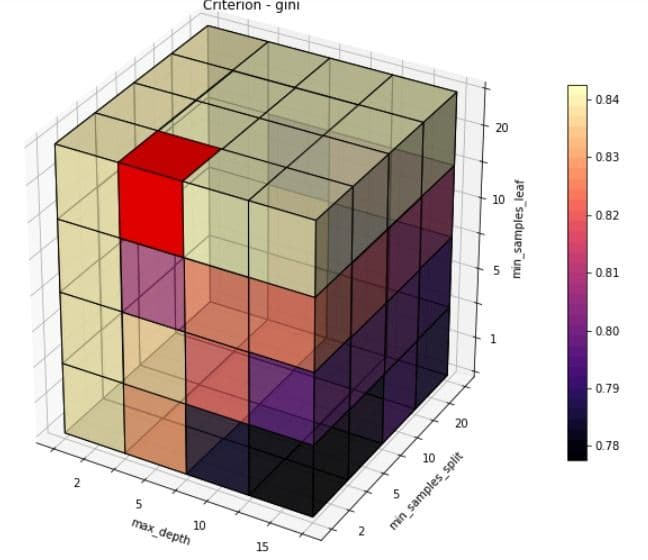
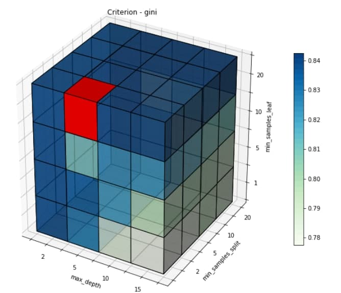
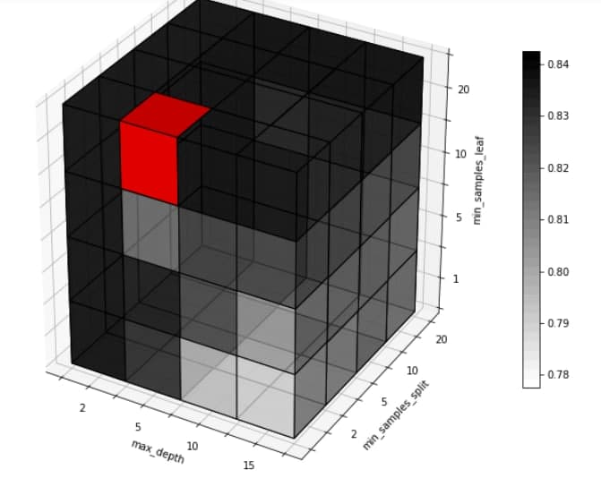
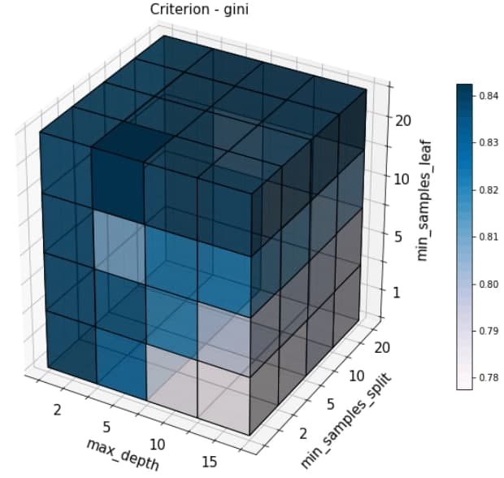
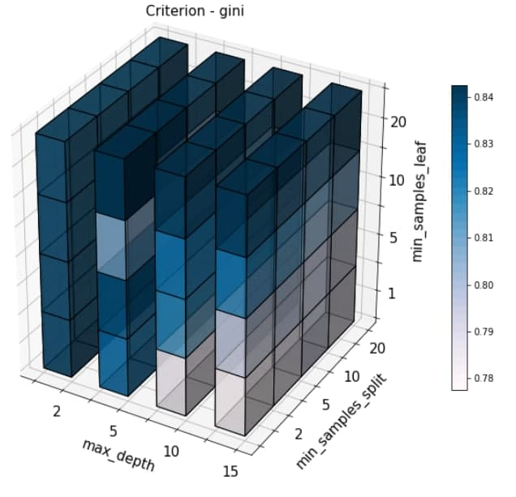

[](https://opensource.org/licenses/)
[](https://pypi.python.org/pypi/yt2mp3/)

### Getting Started

### Install the Pypi package using pip
From https://pypi.org/project/heatmap3Dlib/0.1.1/
```
pip install heatmap3Dlib==0.1.1
            or
pip install heatmap3Dlib
```

### Complete example of using
See the Examples folder where you will find examples of gridsearch results
```python
import heatmap3Dlib
from heatmap3Dlib import plot3D as p3D

x_ticks = ["", "None", "       2", "","5", "       10", "", "15 ", "       20"]
y_ticks = ["", "", "2", "5",  "10", "15", "20"]
z_ticks = ["    1","     5", "     10", "    15", "   20"]

ax, fig, cbr = p3D.heatmap_3d(path = "Examples/recall_resultDT.csv", metric = "recall", optimal = [0, 2, 20], 
            crt = ("criterion",'gini'), 
            param1 = "max_depth",
            param2 = "min_samples_split",
            param3 = "min_samples_leaf",
            modul=2)
ax.set_xticklabels(x_ticks, fontsize=12)
ax.set_yticklabels(y_ticks, fontsize=12)
ax.set_zticklabels(z_ticks, fontsize=12)
ax.set_xlabel("max_depth", fontsize=15, labelpad=10)
ax.set_ylabel("min_samples_split", fontsize=15, labelpad=10)
ax.set_zlabel("min_samples_leaf", fontsize=15, labelpad=10)
ax.set_title("Criterion - ", fontsize=15, loc='center', pad=15)
ax.view_init(30,300)
fig.savefig("DT_all.png", format="png")
```
### Example results
<p align=center>
    
</p>


### Clone the repo
Get a copy of this repo using git clone
```
git clonehttps://github.com/MatteoBiviano/heatmap_3Dlib.git
```

### Functions heatmap_3d

#### Brief
Function that use matplotlib voxels for visualize grid search results

#### Parameters
```
:param path: path for the dataframe contains grid search results
    dataframe must be in one of these form:
        - <name_metric_tuned, "criterion", param1, param2, param3>
        - <param1, param2, param3>
:param optimal: list of optimal values combination (e.g. [max_depth, min_samples_split, min_samples_leaf])
:param param1: first parameter tuned (x-axis)
:param param2: second parameter tuned (y-axis)
:param param3: third parameter tuned (z-axis)
:param modul: number of spaces between each pair of heatmaps plotted
:param metric: metric used in grid search (e.g. "f1", "accuracy", ...)
:param crt: (optional) pair (name_column, criterion) where name is the name used for identify the column in dataframe, while criterion is the criterion used in grid search (e.g. "gini", "entropy", ...)
:param color_map: (optional) color template for the heatmap
:param define_opt: (optional) is the list of RGBA using for identify optimal value (e.g. [1, 0, 0, 1]). If is not defined, alpha=1 identify optimal value
```
#### Return 
```
return: tuple <axis, figure, colorbar>
```

### Other Output Examples
<p align=center>
    
    
    
    
            
    
</p>
